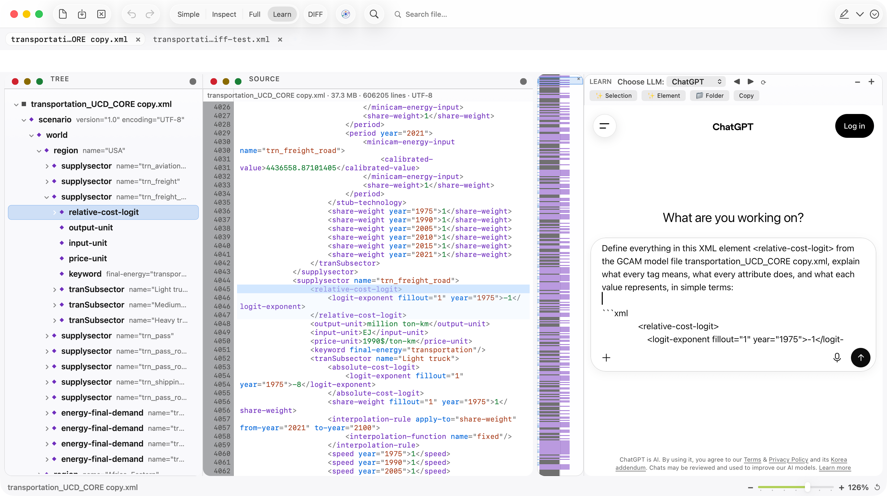
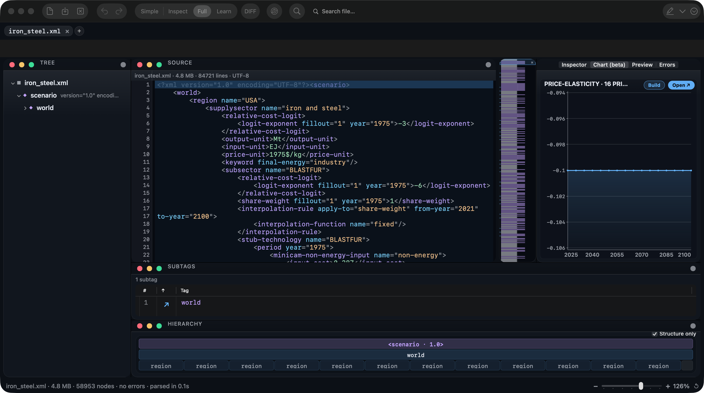
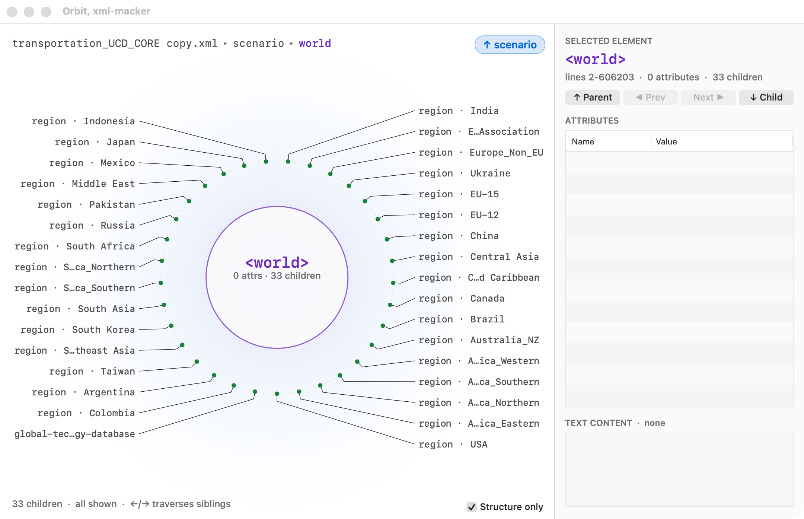
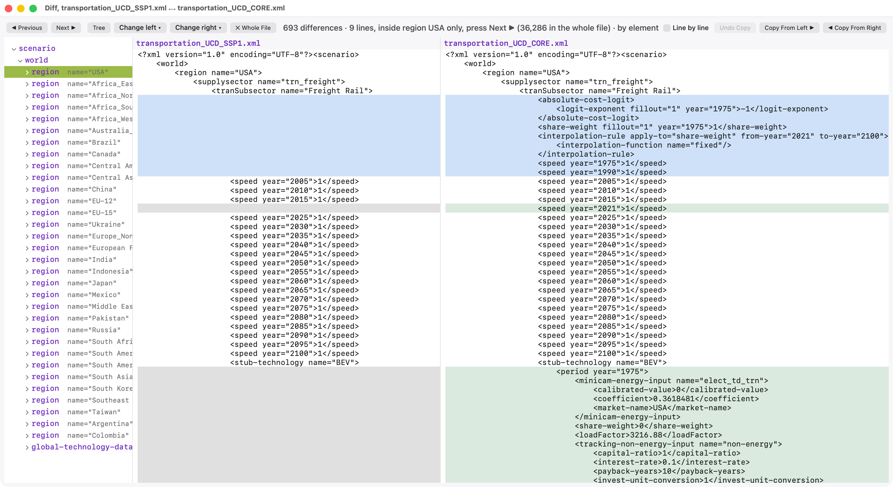

# xml-macker

xml-macker is an XML editor built for large xml files and tested on
[GCAM](https://github.com/JGCRI/gcam-core) input files.

It is designed to work with XML files containing millions of lines,
while providing both a normal source editor and tools for navigating
and editing the XML structure.

Available for macOS and Windows.

| | macOS | Windows |
|---|---|---|
| Source | [`macos/`](macos) | [`windows/`](windows) |
| Built with | Swift 6, AppKit | .NET 8, WPF |
| Requires | macOS 13+, Apple Silicon | Windows 10 or 11, x64 |

## Features

- Open and edit very large XML files, tested on a 13 million line file
  that opens in about 20 seconds.
- Open referenced files directly by clicking their paths inside the XML.
- Browse the XML using both a tree and a syntax-highlighted source
  editor.
- Edit elements and attributes while keeping the different views
  synchronized.
- Detect XML errors while editing.
- Search and replace text or values across the file.
- Compare two XML files with an element-aware Diff view.
- Plot numerical data from XML elements and export charts or CSV files.
- Highlight and save important parts of a file with Marker.
- Use Tree, Subtags, Inspector, Hierarchy, Preview and Orbit views to
  inspect XML structure.
- Open multiple files in tabs and use drag and drop.
- Use the Learn workspace to work with an AI chat beside the XML file.

## Screenshots

The Learn workspace: the tree, the source editor and a chat beside the
file.



| Full layout | Orbit |
|---|---|
|  |  |

Diff, pairing the two files element by element and scoped to one region.



## Install

Download the build for your system from
[Releases](../../releases).

**macOS.** Unzip and drag `xml-macker.app` into Applications. On the
first launch macOS warns about an unidentified developer: open
**System Settings, Privacy and Security**, click **Open Anyway** and
confirm.

**Windows.** Run `xml-macker-setup.exe` for a Start-menu entry and an
uninstaller, or take the portable `xml-macker.exe` and run it from
anywhere. Windows SmartScreen may warn about an unrecognised
publisher: choose **More info**, then **Run anyway**.

## Build from source

**macOS**, needing only the Xcode Command Line Tools
(`xcode-select --install`):

```bash
cd macos
./build-app.sh release     # SwiftPM build, then the .app bundle
open dist/xml-macker.app
```

**Windows**, needing the .NET 8 SDK:

```bat
cd windows
dotnet build xml-macker.sln -c Release
dotnet run --project src\xml-macker\xml-macker.csproj -c Release
```

The installer is built from `windows/installer/xml-macker.iss` with
[Inno Setup 6](https://jrsoftware.org/isinfo.php).

## Checking a build

Each version carries its own harness, so a build can be checked without
an IDE:

```bash
cd macos && ./tools/check.sh        # compiler, self-checks, diff engine, launch
cd macos && ./tools/check.sh --ui   # the above, plus a scripted pass over the interface
```

```bat
cd windows
dotnet run --project src\xml-macker-tests\xml-macker-tests.csproj -c Release
```

On macOS, `dist/xml-macker.app/Contents/MacOS/xml-macker --self-check` runs the assertions alone and exits.

## License

MIT. Developed by Ahmed SM Sobhy, KAIST IAM Group.
